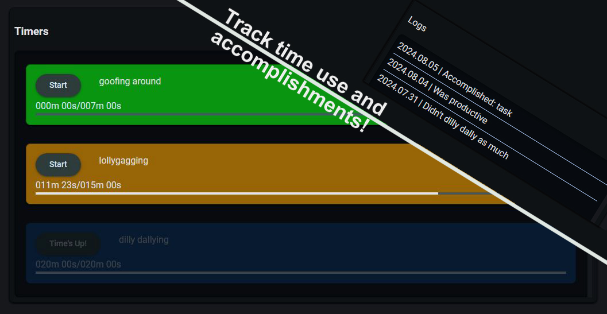

# Timers

Timers is a simple productivity tool that helps users focus on the first step of creating productive habits: awareness. 

The goal of using Timers is to balance productivity and leisure time by encouraging the user to set time limits for activities they enjoy but want to limit. This creates more awareness of how one's time is spent so they can be confronted with the negative emotions associated with "wasting time". Timers also aims to boost the positive emotions from accomplishing "productive" tasks by providing a log book to record progress over time, and a goals board to help remind users why they want to change their habits.

Use at [https://rsninja.dev/Timers](https://rsninja.dev/Timers).

## Technologies 

| Technology | Description |
| --- | --- |
| [material-web](https://github.com/material-components/material-web) | Web implementation of Google's [Material Design](https://m3.material.io/) |
| [webpack](https://webpack.js.org/) | Bundles modules into static assets |

weather provided by [wttr.in](https://github.com/chubin/wttr.in)

## Building

- Clone the repository
- Run `npm install`
- Run `npm run build`

## Usage

### Info bar

- hover over weather text to see more information

### Controls

- presets - a preset is a group of timers that can be swapped in and out of the active timers list
    - create a new preset with the "Add Preset" button
    - activate a preset by clicking the button with the respective preset's name
    - switching presets does not reset timer progress
- timers - create a new timer with the interface in the top left, new timers will be added to the active preset
- "Next Day" button - to reset the progress on all timers once a new day has started, press this button
- "Settings" button - opens a menu to export/import a save, and to merge the logs or goals from a different saves into the active save

### Timers

- once a timer reaches its max time, an alarm will sound and the timer will be disabled for the rest of the day

### Log book

- enter any text into the log book to track progress, logs will be automatically timestamped

### Goals

- a simple list that goals can be added and removed from

